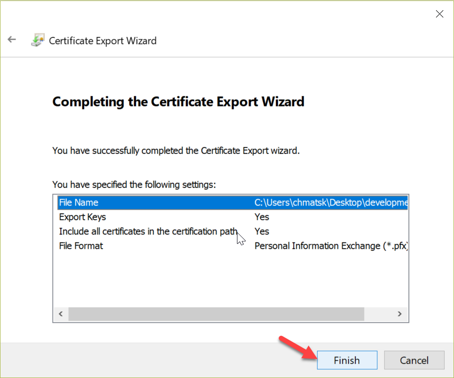

Digite o comando abaixo para criar o certificado:

Gerador no build:

New-SelfSignedCertificate -Subject "localhost" -DnsName "localhost" -FriendlyName "Functions Development" -KeyUsage DigitalSignature -TextExtension @("2.5.29.37={text}1.3.6.1.5.5.7.3.1")

............................................................................................................

New-SelfSignedCertificate -NotBefore (Get-Date) -NotAfter (Get-Date).AddYears(1) -Subject "localhost" -KeyAlgorithm "RSA" -KeyLength 2048 -HashAlgorithm "SHA256" -CertStoreLocation "Cert:\CurrentUser\My" -KeyUsage KeyEncipherment -FriendlyName "HTTPS development certificate" -TextExtension @("2.5.29.19={critical}{text}","2.5.29.37={critical}{text}1.3.6.1.5.5.7.3.1","2.5.29.17={critical}{text}DNS=localhost")

Em seguida abra o programa Gerenciar Certificados de Usuário (Manage user certificates)

Navegue para: Pessoal (Personal) -> Certificados (Certificates)

Selecione e copie o certificado criado (localhost)

Depois navegue para: Autoridades de Certificação Raiz Confiáveis (Trusted Root Certification Authorzation) -> Certificados (Certificates)

E colo o arquivo copiado para essa pasta

Posteriormente para exportar o arquivo, clique em cima do arquivo -> Todas as tarefas (All Tasks) -> Exprotar (Export)

